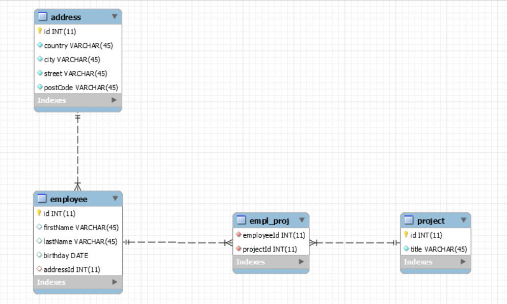

# JDBC and MySQL database application.

The application describes work with JDBC and MySQL database.
The application is divided in 3 layers: models, dao and service.

# Database structure.

# SQL Scripts.

CREATE TABLE `address` (
  `id` int(11) NOT NULL,
  `country` varchar(45) NOT NULL,
  `city` varchar(45) NOT NULL,
  `street` varchar(45) NOT NULL,
  `postCode` varchar(45) NOT NULL,
  PRIMARY KEY (`id`)
) ENGINE=InnoDB DEFAULT CHARSET=utf8mb4 COLLATE=utf8mb4_0900_ai_ci

CREATE TABLE `employee` (
  `id` int(11) NOT NULL,
  `firstName` varchar(45) DEFAULT NULL,
  `lastName` varchar(45) DEFAULT NULL,
  `birthday` date DEFAULT NULL,
  `addressId` int(11) DEFAULT NULL,
  PRIMARY KEY (`id`),
  KEY `fk_addressId_idx` (`addressId`),
  CONSTRAINT `fk_addressId` FOREIGN KEY (`addressId`) REFERENCES `address` (`id`)
) ENGINE=InnoDB DEFAULT CHARSET=utf8mb4 COLLATE=utf8mb4_0900_ai_ci

CREATE TABLE `project` (
  `id` int(11) NOT NULL,
  `title` varchar(45) NOT NULL,
  PRIMARY KEY (`id`)
) ENGINE=InnoDB DEFAULT CHARSET=utf8mb4 COLLATE=utf8mb4_0900_ai_ci

CREATE TABLE `empl_proj` (
  `employeeId` int(11) NOT NULL,
  `projectId` int(11) NOT NULL,
  KEY `employeeId_fk_idx` (`employeeId`,`projectId`),
  KEY `projectId_fk_idx` (`projectId`),
  CONSTRAINT `employeeId_fk` FOREIGN KEY (`employeeId`) REFERENCES `employee` (`id`),
  CONSTRAINT `projectId_fk` FOREIGN KEY (`projectId`) REFERENCES `project` (`id`)
) ENGINE=InnoDB DEFAULT CHARSET=utf8mb4 COLLATE=utf8mb4_0900_ai_ci
